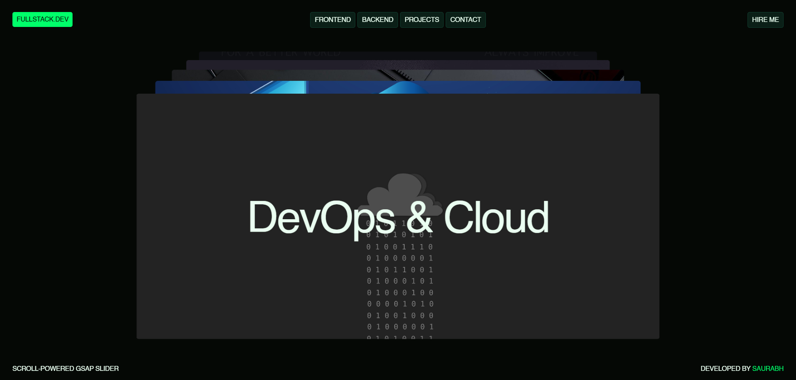

# 🎨 Scroll-Powered GSAP Slider

<div align="center">

**A modern, interactive scroll-powered slider with smooth animations and responsive design**

[](LICENSE)
[](https://html.spec.whatwg.org/)
[](https://www.w3.org/Style/CSS/)
[](https://developer.mozilla.org/en-US/docs/Web/JavaScript)
[](https://gsap.com/)

</div>

---

[](https://your-live-demo-link.com)

---

## 📋 Table of Contents

- [Features](#-features)
- [Demo](#-demo)
- [Tech Stack](#-tech-stack)
- [Installation](#-installation)
- [Usage](#-usage)
- [Project Structure](#-project-structure)
- [How It Works](#-how-it-works)
- [Browser Support](#-browser-support)
- [License](#-license)
- [Author](#-author)

---

## ✨ Features

- **🖱️ Scroll-Triggered Animation**: Smooth slide transitions powered by mouse wheel events
- **📱 Touch Support**: Full mobile responsiveness with touch gesture controls
- **🎬 Advanced Animations**: GSAP SplitText for word-by-word text animations
- **🎨 Modern UI Design**: Clean, professional interface with smooth transitions
- **⚡ Performance Optimized**: Efficient event handling with debouncing and accumulation
- **🎯 Perspective 3D**: 3D perspective effects for immersive slide presentation
- **🌈 Custom Theming**: Carefully designed color scheme with CSS variables
- **♿ Accessible**: Semantic HTML and keyboard-friendly navigation

---

## 🚀 Demo

**Live Project**: [View Live Demo](https://scroll-slider-gamma.vercel.app/)

---

## 🛠️ Tech Stack

| Technology | Purpose |
|-----------|---------|
| **HTML5** | Semantic markup and structure |
| **CSS3** | Styling, animations, and responsive design |
| **JavaScript (ES6+)** | Core functionality and interactivity |
| **GSAP 3** | Advanced animation library |
| **SplitText** | Text animation plugin |

---

## 📦 Installation

### Clone the Repository

```bash
git clone https://github.com/Saurabh-git-hub/Scroll-Slider-
cd scroll-slider
```

### No Build Process Required!

This project runs directly in the browser with no build steps. Simply open `index.html` in your browser or use a local server.

### Using Live Server (Recommended)

```bash
# If you have Live Server installed
# Open with Live Server in VS Code or use:
python -m http.server 8000
# Then navigate to http://localhost:8000
```

---

## 🎮 Usage

### Basic Setup

1. **Open the project** in your browser
2. **Scroll up/down** to navigate between slides
3. **On mobile**: Swipe up/down to change slides

### Customization

#### Adding New Slides

Edit the `slideData` array in `script.js`:

```javascript
const slideData = [
    { title: "Your Slide Title", Image: "./Assets/images/your-image.jpg" },
    // Add more slides as needed
];
```

#### Changing Colors

Modify CSS variables in `style.css`:

```css
:root {
    --base-100: #eafff1;     /* text color */
    --base-200: #0f3d2e;     /* borders */
    --base-300: #0b1f17;     /* cards */
    --base-400: #050805;     /* background */
    --base-500: #00ff6a;     /* accent color */
}
```

#### Adjusting Animation Speed

Modify thresholds and timeouts in `script.js`:

```javascript
const wheelThreshold = 100;        // Scroll sensitivity
const touchThreshold = 50;         // Touch sensitivity
setTimeout(() => (...), 1200);     // Animation duration
```

---

## 📁 Project Structure

```
scroll-slider/
├── index.html          # Main HTML file
├── style.css          # Stylesheet with CSS variables
├── script.js          # Core JavaScript logic
├── README.md          # This file
└── Assets/
    └── images/
        ├── slider1.jpg
        ├── slider2.jpg
        ├── slider3.jpg
        ├── slider4.jpg
        ├── slider5.jpg
        └── my-favicon.png
```

---

## 🎯 How It Works

### Scroll Detection
- Uses wheel event listener with accumulator pattern
- Debounces rapid scrolls with `wheelThreshold`
- Prevents multiple simultaneous animations

### Touch Handling
- Detects swipe gestures with `touchstart` and `touchend` events
- Calculates gesture direction and distance
- Requires minimum threshold to trigger slide change

### Animation Pipeline
1. **SplitText**: Breaks titles into words for individual animation
2. **GSAP Timeline**: Coordinates multiple animations simultaneously
3. **3D Transform**: Applies perspective and depth to slides
4. **State Management**: Prevents animation conflicts

### Slide Positioning
```javascript
gsap.set(slide, {
    y: -15 + 15 * i + "%",   // Vertical stacking
    z: 15 * i,               // Depth effect
    opacity: 1,              // Visibility
});
```

---

## 🌐 Browser Support

| Browser | Support |
|---------|---------|
| Chrome | ✅ Latest |
| Firefox | ✅ Latest |
| Safari | ✅ Latest |
| Edge | ✅ Latest |
| Mobile Safari | ✅ iOS 12+ |
| Chrome Mobile | ✅ Android |

**Note**: Requires ES6+ JavaScript support.

---

## 📄 License

This project is licensed under the **MIT License** - see the [LICENSE](LICENSE) file for details.

---

## 👨‍💻 Author

**Saurabh Chauahan** - SWE

- 🌐 Portfolio: [saurabh-website](https://saurabh-s-w-e.vercel.app/)
- 💼 GitHub: [@saurabh-github](https://github.com/Saurabh-git-hub)
- 📧 Let's connect!

---

<div align="center">

**Made with ❤️ by Saurabh Chauahan**

If you find this project useful, please consider giving it a ⭐

</div>
